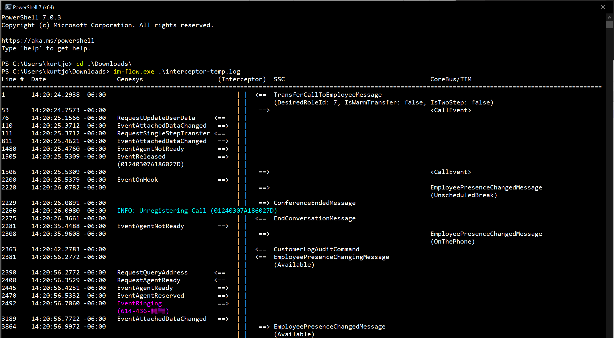

# Interceptor Message Flow App
This `im-flow` .NET Core console application summarizes the message flow between Genesys, the Interceptor, and the SSC.  



For this screenshot, the output shows messages as follows:
* SSC sends `TransferCallToEmployeeMessage` to Interceptor
* Interceptor calls `CallEvent` endpoint on TIM Service
* Interceptor sends `RequestUpdateUserData` to Genesys
* Genesys sends `EventAttachedDataChanged` to Interceptor
* Interceptor sends `RequestSingleStepTransfer` to Genesys
* Genesys sends `EventAttachedDataChanged` to Interceptor
* and so on...

Notice that selected INFO log-level messages are displayed in a cyan color (the `-f` command-line parameter will cause all INFO log-level messages to be displayed).  Also, events that indicate the beginning of a call (e.g., `EventRining`, `RequestMakeCall`, etc.) are displayed in a magenta color.  Error entries in the log file (all of which are always shown) are displayed in a red color.

Some message (such as the `TransferCallToEmployeeMessage` in the screenshot above) also have annotations displaying extra information about the message.  (These annotations can be disabled using the `-a` command-line parameter).

## Example Usage
By default, this app writes its output to the console.  The app can be run for a given Interceptor log file using either:

```
.\im-flow.exe c:\some-path\interceptor.log
```

...or:

```
.\im-flow.exe -i c:\some-path\interceptor.log
```

Multiple files can be specified, and wildcards can be used:

```
.\im-flow.exe -i interceptor.log interceptor.20201106.*.log
```

When this application processes multiple files, it will preceed each file's set of entries with a header naming the log file.

Note that the application, by default, will modify the width of the console in which it is run to fit the output.  To disable that, use the `-x` command-line parameter:

```
.\im-flow.exe -x -i c:\some-path\interceptor.log
```

## Highlighting a given message

The `-m` or `--match-messages` command-line parameter can be used to highlight (in a green color) a given message:

```
.\im-flow.exe c:\some-path\interceptor.log -m EventReleased
```

Note that multiple messages can be specified:

```
.\im-flow.exe c:\some-path\interceptor.log -m EventAgentLogin EventAgentLogout
```

## Other command-line parameters

Help text can be displayed by using the `--help` command-line parameter.

By default, TServer connection heartbeat message, which are so numerous as to bloat the output, are not displayed.  However, the `-h` or `--include-heartbeat` command-line parameters can be used to include those messages in the output.

By default, the application interprets the log dates within the log file as UTC dates.  However, in the past, Interceptor log files used local dates.  The `-l` or `--local-dates` command-line parameter can be used to interpret the log dates as local dates—useful for processing older Interceptor log files.

## Write Output to File
The application can also be write its output to a file using the `-o` command-line parameter:

```
.\im-flow.exe -i c:\some-path\interceptor.log -o c:\some-path\results.txt
```

## Opening Results in an Editor
The application can also automatically open the results in whatever application is registered with Windows to open files using the `-e` command-line parameter.

For instance, if you specify to write the results to a file named `results.log` and you have `.log` files registered with Windows to open using [Visual Studio Code](https://code.visualstudio.com/):

```
.\im-flow.exe -e -i c:\some-path\interceptor.log c:\some-path\results.log
```

...then the application will save the results to that file and then open the file in Visual Studio Code.

Alternately, you can leave off the name of the output file (while using the `-e` command-line parameter)—in which case, the application will save the results to a temp file ending in `.txt` and then open it in whatever application is registered in Windows to open `.txt` files.

```
.\im-flow.exe -e -i c:\some-path\interceptor.log
```
